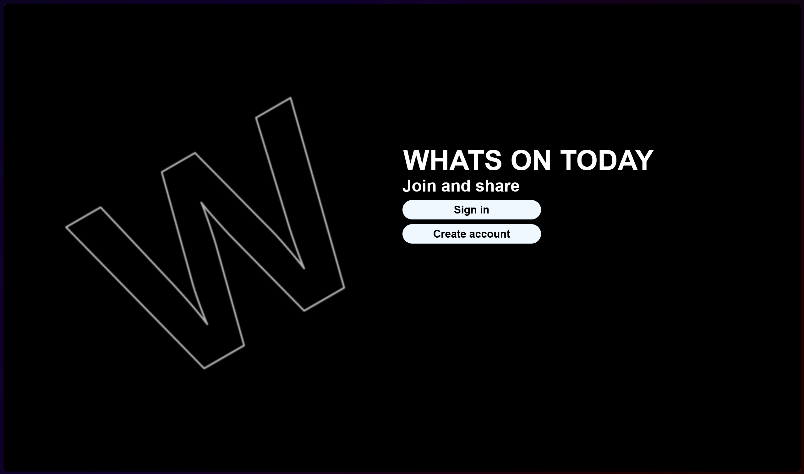
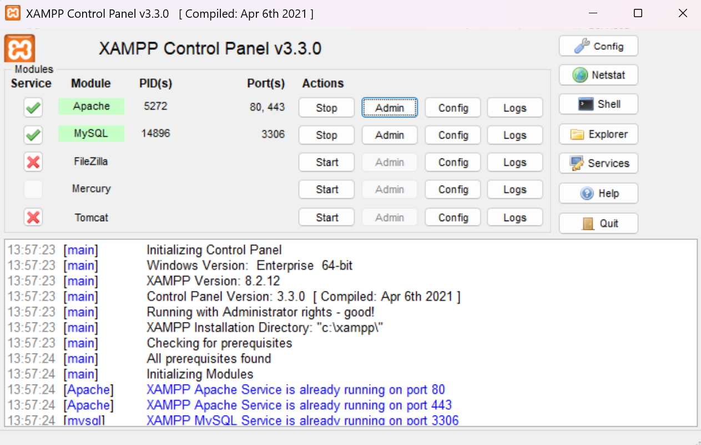
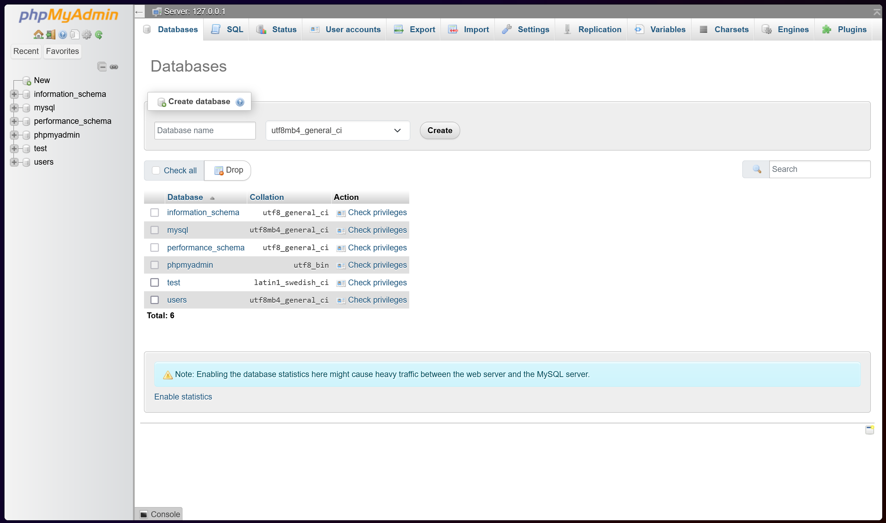
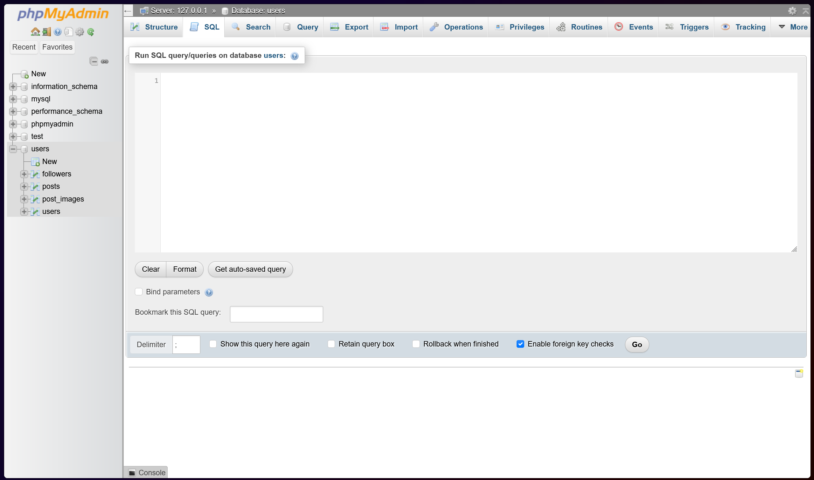

# What'sUP

**What'sUP** is a social media web application, similar to platforms like Instagram or X, where users can create accounts, log in. The application allows users to share posts, view content, and manage their profiles.

## Features:
- **Account Creation**: Users can create their accounts and log in.
- **Post Sharing**: Users can share posts.
- **Profile Management**: You can change your username, password and profile picture, you can see your posts, Followers and who's Following you.
- **Chats**: NOT IMPLEMENTED

## Requirements:
- **XAMPP**: You'll need XAMPP to set up a local server.
- **Node.js**: Make sure Node.js is installed.
- **API Configuration**: Configure the provided API on your local machine to interact with the database and serve data.

## Installation:

1. **Set Up XAMPP**:
   - Install [XAMPP](https://www.apachefriends.org/index.html).
   - Open XAMPP Control Panel and start Apache and MySQL.
   - Navigate to your XAMPP installation and delete what's inside the "htdocs" folder and create a folder inside called "restapi" after that paste the [API](#api-files) files inside that new folder
     
2. **Set Up MySQL Database with XAMPP**:
   - [MySQL](#mysql)
   
3. **Install Dependencies**:
   - Clone the repository:
     ```bash
     git clone https://github.com/jlfernandes22/Projeto_final.git
     ```
   - Navigate to the project folder:
     ```bash
     cd Projeto_final
     ```
     ```bash
     cd FrontOffice
     ```
   - Install Node.js dependencies:
     ```bash
     npm install
     ```
   
4. **Run the Application**:
   - Start the server:
     ```bash
     npm run dev
     ```
   - Then open your broswer and go to the link that appeared in your console must be something like this one `http://localhost:3000`

## Demo



## MySQL

- Click the button admin next to MySQL

- Just create the data base with the name "users"

- Having the new DataBase selected just paste all the code below and press "GO"
  
```bash
CREATE TABLE users (
    id INT AUTO_INCREMENT PRIMARY KEY,
    name VARCHAR(255) NOT NULL,
    pass VARCHAR(255) NOT NULL,
    profile_picture MEDIUMTEXT,  -- To store the base64 string of the profile picture
    created_at TIMESTAMP DEFAULT CURRENT_TIMESTAMP,
    updated_at TIMESTAMP DEFAULT CURRENT_TIMESTAMP ON UPDATE CURRENT_TIMESTAMP
);
CREATE TABLE posts (
    id INT AUTO_INCREMENT PRIMARY KEY,
    user_id INT NOT NULL,
    caption TEXT,
    created_at TIMESTAMP DEFAULT CURRENT_TIMESTAMP,
    updated_at TIMESTAMP DEFAULT CURRENT_TIMESTAMP ON UPDATE CURRENT_TIMESTAMP,
    FOREIGN KEY (user_id) REFERENCES users(id) ON DELETE CASCADE
);
CREATE TABLE post_images (
    id INT AUTO_INCREMENT PRIMARY KEY,
    post_id INT NOT NULL,
    image_base64 MEDIUMTEXT,  -- To store the base64-encoded image data
    created_at TIMESTAMP DEFAULT CURRENT_TIMESTAMP,
    FOREIGN KEY (post_id) REFERENCES posts(id) ON DELETE CASCADE
);
CREATE TABLE followers (
    id INT AUTO_INCREMENT PRIMARY KEY,
    follower_id INT NOT NULL,
    followed_id INT NOT NULL,
    created_at TIMESTAMP DEFAULT CURRENT_TIMESTAMP,
    FOREIGN KEY (follower_id) REFERENCES users(id) ON DELETE CASCADE,
    FOREIGN KEY (followed_id) REFERENCES users(id) ON DELETE CASCADE,
    UNIQUE(follower_id, followed_id)  -- Prevent duplicate follow relationships
);

```
## API Files
[users.php](Projeto_final/API_FIles/users.php)
[db.php](Projeto_final/API_FIles/db.php)
